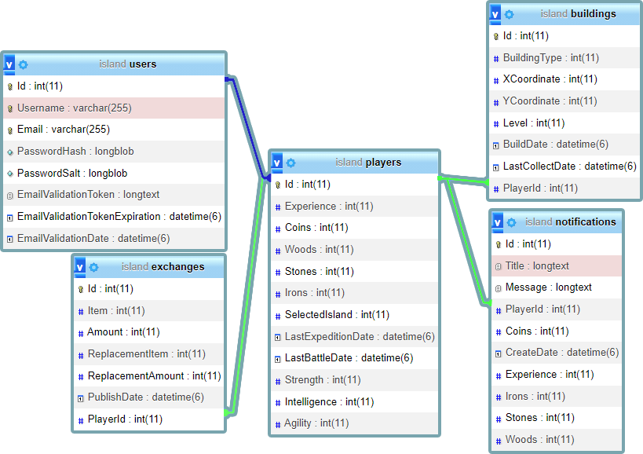

# Islanders backend repo

## Adatbázis diagram

## A frontend szükséges a teljes program működéséhez, ami egy másik repositoryban van.

[Frontend repository elérése](https://github.com/fireball90/island_base)

## A projekt indításához szükséges feltételek

A projekt indításához az alábbi követelmények szükségesek:
- .NET 6.0 SDK telepítése
- Visual studio (lehetőleg 2022-es verzió)
- Xampp (adatbázis indításához)
- A projekt fileok klónozása vagy kicsomagolva letöltése
- SQL file, amit a "database" mappában talál meg a repositoryban.

## A projekt indítása

1. Elindítjuk a Xampp nevű programot, majd az Apache és a Mysql felirat melletti start gombbal elindítjuk a szervert és az adatbázist.
2. A mysql sorában az Admin gombra kattitunk, ami megnyit egy ablakot az adatbázis felületével. Vagy a böngésző sávjába bemásoljuk az alábbi szöveget: [http://localhost/phpmyadmin/](http://localhost/phpmyadmin/)
3. Létrehozunk egy új adatbázist `island` néven, utf-8 hungarian kódolással.
4. Megnyitjuk az Islands.sln-t Visual studioban.
5. Packet manager console-ban beírjuk az : `update-database` parancsot.
6. Ezután visszatérünk a mysql adatbázishoz és beolvassuk a repository "database" mappájában található sql file-t, hogy feltöltsük ellenfelekkel az adatbázist.
7. Elindítjuk a backendet és megnyílik egy új ablakban a swagger az apikkal.

## Mobil App letöltése: [Drive link](https://drive.google.com/file/d/1WGelaRy3E8ZCe_cKAB6aX95UlDfARWSi/view?usp=sharing)

## Webes deploy elérése: [https://islanders-b7706.web.app/island](https://islanders-b7706.web.app)

## A `Prezentacio` mappában található:
- Magyar nyelvű prezentáció (PDF és PPTX formátumban)
- Angol nyelvű prezentáció (PDF és PPTX formátumban)

## A `Dokumentacio` mappában található:
- Dokumentáció a programról (PDF és DOCX formátumban)
- Tesztelési dokumentáció (PDF és DOCX formátumban)
